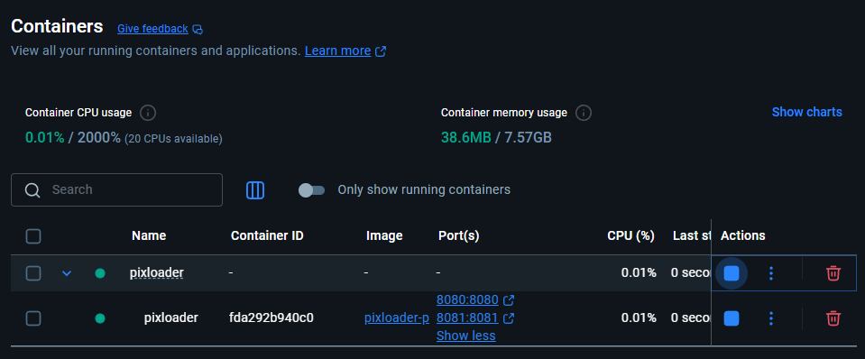
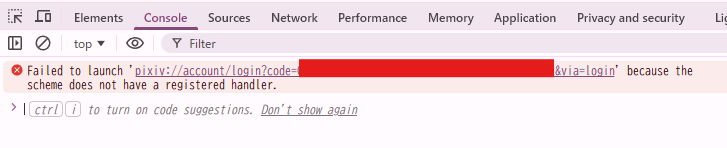

# Pixloader

※基本的にOpenAI/Codexに全部任せて作ってもらいました

Pixloader は、Pixiv のブックマーク一覧を定期的に取得し、画像ファイルをローカルへ自動保存するための軽量サービスです。Docker コンテナとして動作するように設計されており、ボリュームをマウントするだけで画像やダウンロード履歴を永続化できます。

## 主な機能
- ブクマしたpixivの画像をローカルPCにダウンロードする
  - これを見なくて済むようにしたい  

    
- 自分用にブクマ画像を整理。自分だけのタグ付けや、評価をつけられる  
（実際のpixivのサービスには影響しない）
  - 独自に評価を追加することも可能。「かわいさ」とか「かっこよさ」みたいな

## 必要なもの
- Dockerが動く環境  
CPUは2コア・RAMも2GBありゃ足りそう

## クイックスタート
1. Docker Desktopを起動  
インストールしてなければこちらからどうぞ！！  
https://www.docker.com/ja-jp/products/docker-desktop/

1. コンテナを起動  
プロジェクトのルートで以下を実行
    ```bash
    docker compose up -d --build
    ```
    Docker DesktopのContainersから、起動していることを確認  
    

1. 初回設定  
http://localhost:8080 にアクセス  
pixivにログインから自分のアカウントでログイン  

    白い画面に飛ばされるが、F12キーなどで開発者ツールを確認  
    Consoleで `code=` と `&via=login` の間のコードをコピー
    

    http://localhost:8080 の`コールバックURLまたは認証コード`欄にペーストしたら、`トークン取得`をクリック  

    認証したら http://localhost:8080 は使えなくなります

1. 動作確認  
http://localhost:8081 にアクセス  
画像が出てたらOKです  
使い倒せ！！

## こんなときは  
### Q: 保存先フォルダを変えられないんですか？
### A: できます
プロジェクトルートに`.env`というファイルを作り、以下のように記載してください
```
PIXLOADER_HOST_ROOT=<保存したい絶対パス>
```

例）  
```
PIXLOADER_HOST_ROOT=D:\\pixiv\\bookmarks
```
その後、もう1回クイックスタートにある初期設定をやり直してください
#
### Q: スマホで見たいが？
### A: 頑張ればできます
できなくないですが、ネットワーク云々がめんどいです  
使ってるPCのファイアウォールを許可したり、できればIPを固定化したり...が必要です  
それができたら、スマホのブラウザから `http://<PCのIPアドレス>:8081` でアクセスしてみてください  
ルーターの設定もいじれるならどこからでもアクセスできますよ！！

## 環境変数

| 変数名 | 既定値 | 説明 |
| --- | --- | --- |
| `PIXIV_REFRESH_TOKEN` | **必須** | Pixiv のリフレッシュトークン。.env で設定するかブラウザ入力で登録します。 |
| PIXIV_BOOKMARK_RESTRICT | public | public / private / Both を指定します。Both を選ぶと公開・非公開の両方をまとめて取得します。|
| `PIXLOADER_DOWNLOAD_DIR` | `/data` (Docker 時) | 画像を保存するディレクトリ。通常は変更不要です。 |
| `PIXLOADER_DB_PATH` | `<download_dir>/pixloader.db` | ダウンロード履歴を保持する SQLite ファイル。 |
| `PIXLOADER_TOKEN_FILE` | `<download_dir>/refresh_token.txt` | リフレッシュトークンを保存するパス。 |
| `PIXLOADER_MAX_PAGES` | `0` | ブックマークリストを取得するページ数上限。0 で無制限。 |
| `PIXLOADER_INTERVAL_SECONDS` | `0` | 連続実行時の待機秒数。0 で 1 回のみ。 |
| `PIXLOADER_CONCURRENCY` | `4` | 同時ダウンロード数 (1-16)。 |
| `PIXLOADER_TOKEN_PORT` | `8080` | ブラウザからトークンを入力するためのローカルポート。`docker-compose.yml` のポート公開と合わせて変更してください。 |
| `PIXLOADER_ALLOW_PASSWORD_LOGIN` | `true` | ブラウザのセットアップページで Pixiv ID/パスワードを入力してトークンを取得できるようにします。機密情報を扱うため、必要な場合のみ `true` に設定してください。 |
| `PIXLOADER_ENABLE_VIEWER` | `true` | ブラウザビューアを有効化します。`true` にした場合、ダウンロードループと並行して HTTP サーバーが起動します。 |
| `PIXLOADER_VIEWER_PORT` | `8081` | ビューアの公開ポート。 |
| `PIXLOADER_VIEWER_HOST` | `0.0.0.0` | ビューアがバインドするホスト名。LAN に公開する場合のみ変更してください。 |
| `PIXLOADER_HOST_ROOT` | `./data` | ホスト側で `/data` にマウントするディレクトリ。例: `PIXLOADER_HOST_ROOT=D:\\Pixloader-image` |

> **Windows の場合:** Docker Desktop の Settings → Resources → File sharing で対象ドライブ (例: D:) を共有しておく必要があります。
